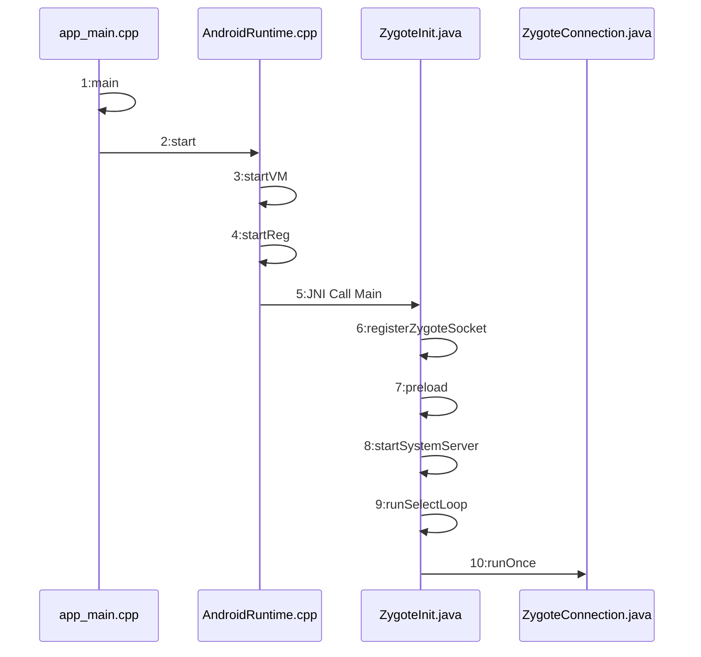

Zygote进程

1. 系统启动时init进程会创建Zygote进程，Zygote进程负责后续Android应用程序框架曾的其他进程的创建和启动
2. Zygote进程会首先创建SystemServer进程
3. 当需要启动一个Android应用程序时，AMS会通过socket机制，通知Zygote进程为这个应用程序创建一个新的进程。
4. zygote通过fork函数创建app进程，共享已运行的虚拟机的代码和内存信息（第7步，预加载资源和类到内存中），可以加快app的启动和运行速度

